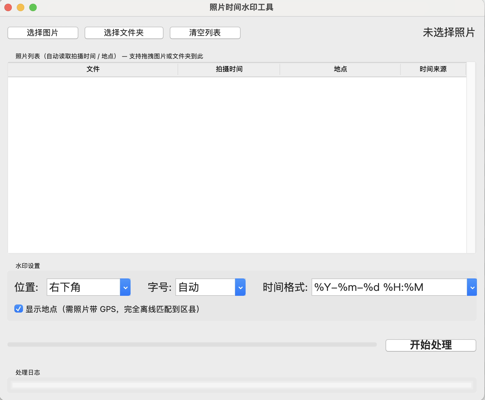
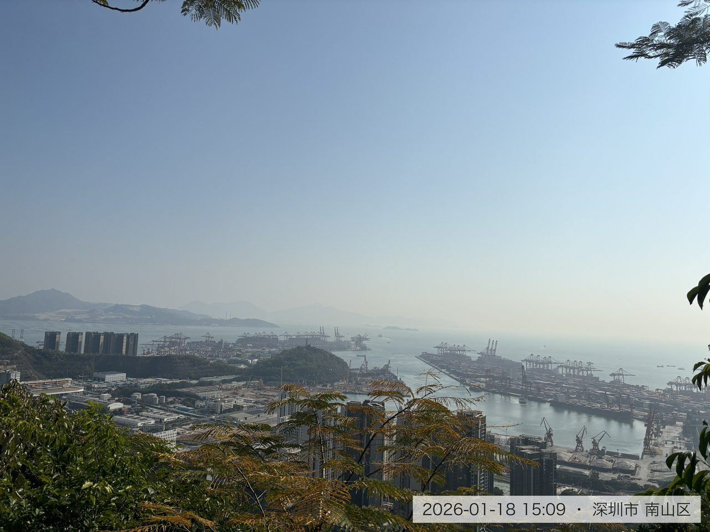

# PhotoStamp-by-AI

> 完全离线的照片时间 + 地点水印工具 · 由 AI 开发完成

给照片批量添加「拍摄时间 + 所在区县」水印，方便翻看照片时一眼知道何时何地拍的。

**全程本地运行，不联网、不上传、不留痕。**

水印效果示例：

```
2023-01-24 16:47 · 北京市 朝阳区
```

## 项目由来

这个项目从需求、设计到全部代码，均由 AI（WorkBuddy / Spark）完成，人类只负责提需求和验收。取一个 `by-ai` 的名字，就是想明确说明这一点。

## 功能特性

- **时间水印**：读取 EXIF 拍摄时间（优先 DateTimeOriginal），精确到分钟
- **地点水印**：读取照片 GPS 坐标，离线匹配到中国区县级地名（约 2840 个区县，来自阿里 DataV.GeoAtlas）
- **自定义水印**：照片经微信等方式传输后 EXIF 会丢失，此时可手动输入水印文字（如记得的大概时间），填写后优先于自动读取
- **完全离线**：区县数据内置，不调用任何在线地图/逆地理编码服务，照片不出本机
- **竖拍不转向**：自动应用 EXIF Orientation，竖拍照片加水印后方向正确
- **HEIC 支持**：iPhone 拍摄的 HEIC/HEIF 格式直接处理，输出转 JPEG
- **批量处理**：支持整个文件夹递归扫描
- **拖拽操作**：图片或文件夹直接拖进窗口即可（需 tkinterdnd2）
- **位置可调**：8 个方位（右下/左下/右上/左上/底部居中/顶部居中/左侧居中/右侧居中）
- **字号可调**：自动（随图片尺寸缩放）/ 小 / 标准 / 大 / 特大
- **时间格式可调**：如 `2023-01-24 16:47`、`2023年1月24日 16:47` 等

## 效果预览

### 软件界面



### 水印效果

右下角时间 + 地点水印，半透明白底保证任何背景下都清晰可读：



## 使用方式

### 输出位置（重要）

水印图**不覆盖原图**，统一保存到：**第一张所选照片所在文件夹下的 `watermarked` 子文件夹**。

例如所选照片在 `~/Desktop/测试/`，输出就在 `~/Desktop/测试/watermarked/`。

全部处理成功时会自动在访达（Finder）中打开该目录；若个别照片处理失败则不会自动打开，请到该目录下查看结果，失败原因见应用内的「处理日志」面板。

### 方式一：源码运行

```bash
# Python 3.10+（需包含 tkinter）
pip install -r requirements.txt
python main.py
```

### 方式二：打包为 macOS 应用

```bash
pip install pyinstaller
pyinstaller --windowed --name "PhotoWatermark" \
  --add-data "data/districts.json:data" \
  --hidden-import pillow_heif \
  --collect-all tkinterdnd2 \
  --noconfirm main.py
```

打包产物在 `dist/PhotoWatermark.app`。

## 项目结构

```
photostamp-by-ai/
├── main.py           # GUI（tkinter + 拖拽）
├── watermark.py      # 核心：EXIF 读取、水印渲染、批量处理
├── geo.py            # GPS 坐标 → 区县名（离线最近邻匹配）
├── data/
│   └── districts.json  # 全国区县数据（含中心点坐标）
├── img/
│   ├── example.JPG   # 水印效果示例
│   └── ui.png        # 软件界面截图
└── requirements.txt
```

## 实现要点

- **时间来源**：EXIF IFD 中 `DateTimeOriginal` > `DateTimeDigitized` > `DateTime`，均无则回退文件修改时间
- **地点匹配**：GPS 度分秒转十进制后，与内置区县中心点做 Haversine 最近邻匹配，超过 50km 视为无法匹配（如海外照片）
- **隐私**：输出图不携带原 EXIF（GPS 等元数据不写入新图），原件不受影响
- **地点精度说明**：区县级（如「北京市 朝阳区」），不含街道。这是离线方案的精度上限——要街道级必须调在线地图服务，与本项目"完全离线"的定位冲突

## 数据来源

`data/districts.json` 基于 [阿里云 DataV.GeoAtlas](https://datav.aliyun.com/portal/school/atlas/area_selector) 提供的行政区划边界数据加工而来，仅保留了区县名称与中心点坐标。

## 协议

本项目采用 [CC BY-NC-ND 4.0](https://creativecommons.org/licenses/by-nc-nd/4.0/deed.zh)（署名-非商业性使用-禁止演绎 4.0 国际）协议发布：

- ✅ 允许：个人学习、自用，原样分享（需保留署名）
- ❌ 禁止：任何形式的商业用途
- ❌ 禁止：修改后再分发（个人本地改动自用不受限，但改完的版本不能对外发布）

详细条款见 [LICENSE](LICENSE)。
